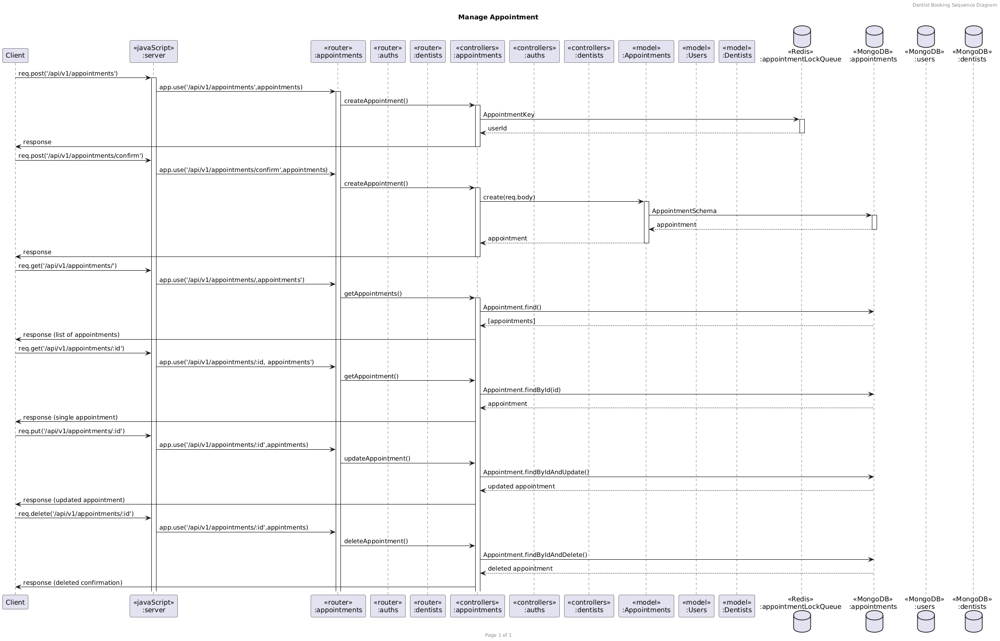
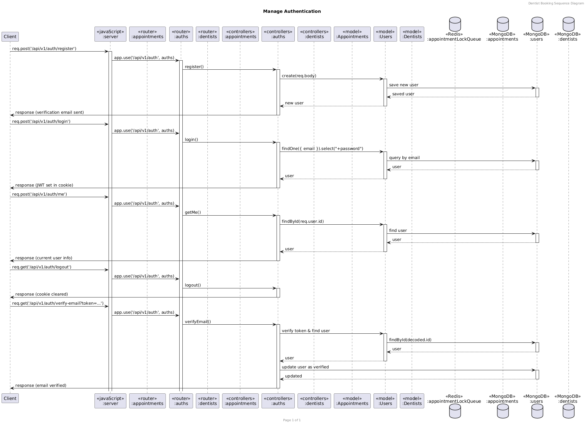
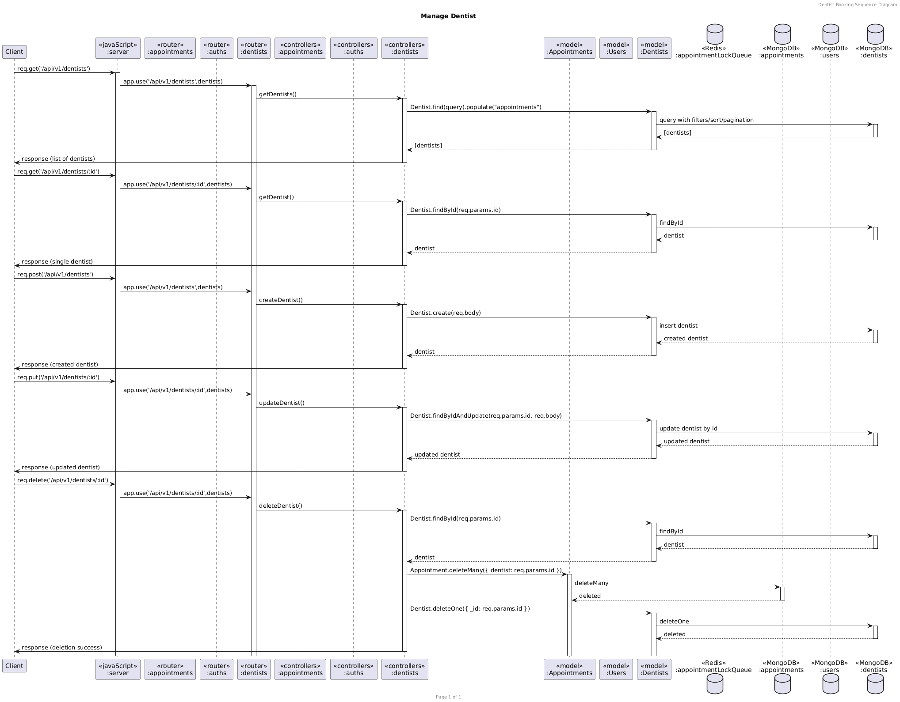

# swdevprac
Dentist Booking Backend Service for Software Engineering I final project

## Installation

1. clone the repository:
   ```bash
   git clone https://github.com/Ntchah/swdevprac.git
   ```
2. set up .env file
3. redis-server --port <YOUR_REDIS_PORT>
4. npm install
5. npm run dev

## Contributing

Commit messages should follow one of the following types:

- feat: A new feature.
- fix: A bug fix.
- refactor: A code change that neither fixes a bug nor adds a feature.
- style: Changes that do not affect the meaning of the code (e.g., whitespace, formatting).
- docs: Documentation only changes.
- chore: Changes to the build process or auxiliary tools and libraries.
- Example commit messages:

```bash
git commit -m "feat: <what-you-did>"
# or
git commit -m "fix: <what-you-fixed>"
# or
git commit -m "refactor: <what-you-refactored>"
```

For more details, refer to the [Conventional commit](https://www.conventionalcommits.org/en/v1.0.0/) format documentation.

## Access redis db
```bash
redis-cli -p 6380 -n 0
```

## Class Diagram

https://drive.google.com/file/d/1Ue3ij0wyIcOpFzY4JcmcVLWJ9oAnwNjc/view?usp=sharing

## Sequence Diagram

Appointment



Authentication



Dentist




